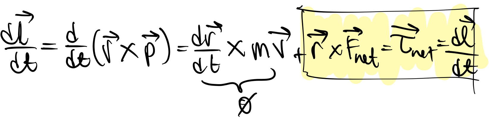

## 14:23
	- ## Physics Lecture
		- ### Review:
			- #### [[Rolling Motion (without slipping)]]
				- K_rolling = K_rotational + K_centerofmass
				- rolling constraints:
					- V_centerofmass = omega * R
					- A_centerofmass = alpha * R
		- ### New material:
			- ### [[Angular momentum]]
				- [[Cross product]] : A X B = ABsin𝛼 where 𝛼 is the angle between vectors A and B
					- Properties of a cross product:
						- TODO add properties
					- [[Determinant method]]:
						- Matrix thingy; see notes for how to do this via Saska's method
						- TODO add image of matrix thingy to page
						- ### Net [[torque]] equals change in [[Angular momentum]] over time
							- {:height 145, :width 563} 
							  This is the same as [[newton's second law]] in terms of momentum, but additionally in terms of *rotational momentum*
							-