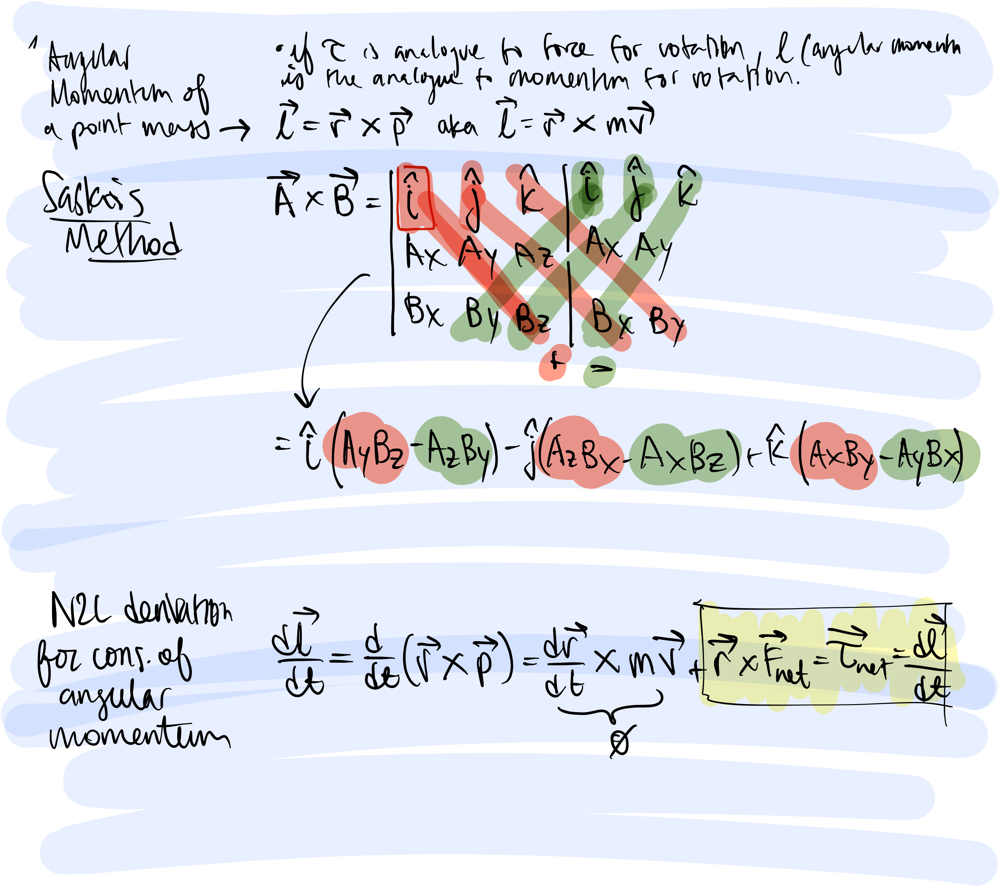

## 14:23
	- ## [[Physics/PHYS 40]] Lecture
		- ### Review:
			- #### [[Rolling Motion (without slipping)]]
			-
		- ### New material:
			- ### [[Angular momentum]]
				- [[Cross product]] : A X B = ABsin𝛼 where 𝛼 is the angle between vectors A and B
					- Properties of a cross product:
						- TODO add properties
					- [[Determinant method]]:
						- Matrix thingy; see notes for how to do this via Saska's method
						- DONE add image of matrix thingy to page
						- ### Net [[torque]] equals change in [[Angular momentum]] over time
							- This is the same as [[newton's second law]] in terms of momentum, but additionally in terms of *rotational momentum*
				- 
		- # 15:27
			- ## reviewing for thurs exam
			- ### any questions?
		-
			-
			-
			-