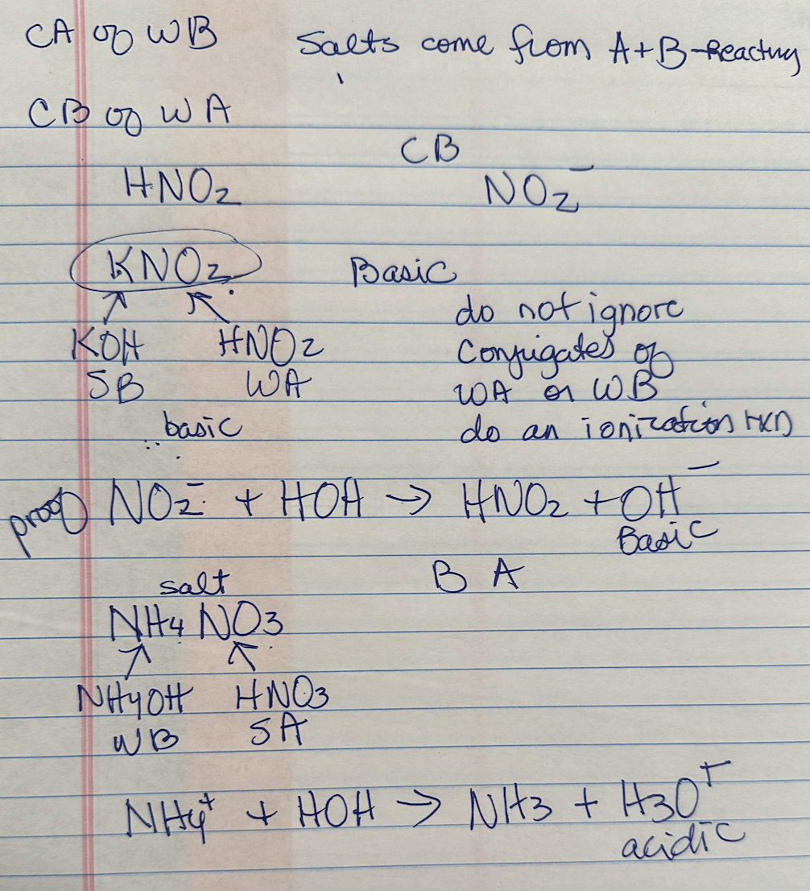

## 18:14
	- ## [[Chemistry/CHEM 3A]]
		- ### [[Acid-base reactions]]
			- quick recap of what we learned last class:
				- 7 [[Strong Acids]] we must remember:
					- HBr, HI, HCl, HNO3, HSO4, HClO3, HClO4
				- [[Strong Bases]] we must remember:
					- First group + Hydroxide (KOH, etc)
					- Ca, Sr, Ba, + Hydroxide
			- what we learned today:
				- reviewed [[molarity]], very briefly introduced to [[molality]]
				- **Conjugate bases** to strong acids are spectators
				- **Conjugate acids** to strong bases are also spectators
				- 
				-